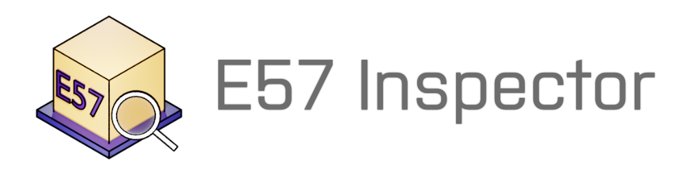
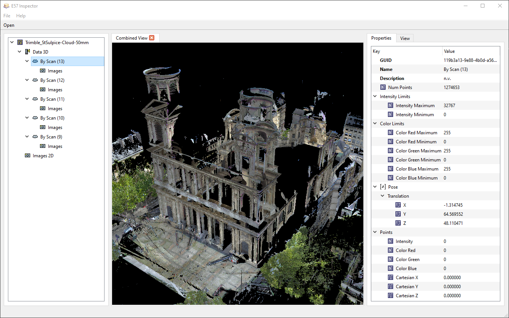
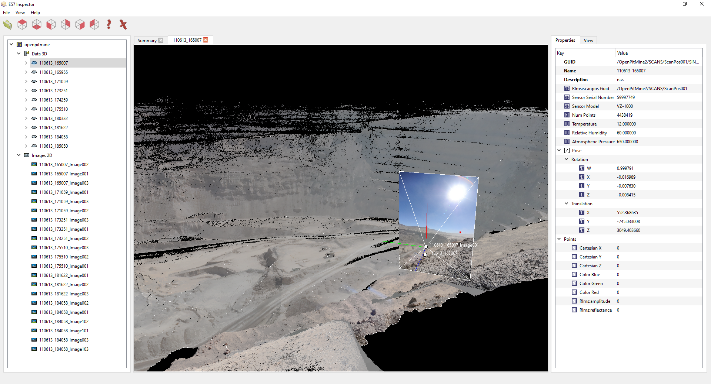
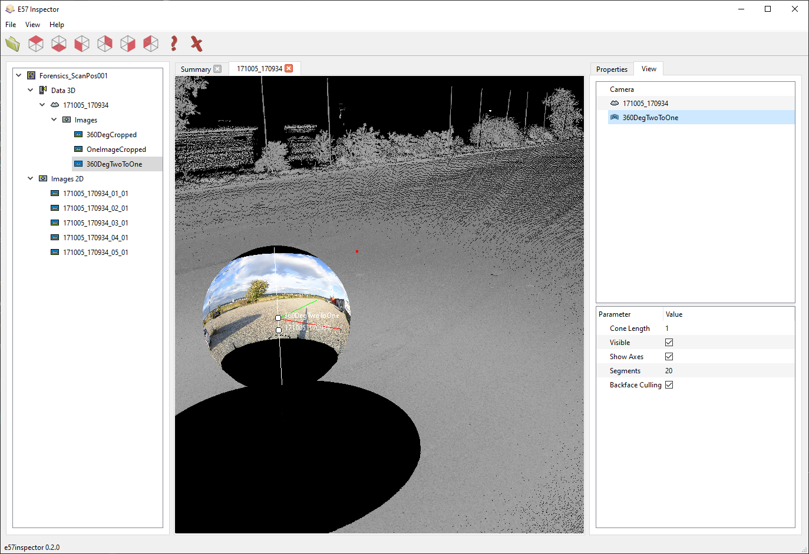

# E57 Inspector

E57 Inspector is an cross-platform E57 file viewer.
An E57 file is a vendor-neutral format for storing point clouds, images and metadata.
It is documented in the [ASTM E2807](https://www.astm.org/e2807-11r19e01.html) standard.

The application can visualize the attributes and fields defined in the file, as well as view the contained point clouds and images.
The program is open-source under the GPLv3 license.
It is in an early development stage but already usable.
For bug reports or feature requests please open an issue.
Feedback of all sort is appreciated.




*(the visualized point cloud is part of the sample data provided by [libE57.org](http://libe57.org/data.html))*

## Overview
To open an E57 file click the "Open" button or choose "Open" from the drop-down menu.
The left panel shows the structure of the E57 files.
The "Data 3D" node holds all scans within the E57.
Images under the top-most "Images 2D" node do not reference a scan within the E57 and are therefor so-called *project* images.
Images underneath the Data 3D nodes are referenced to the according scan.

A *single-click* opens the properties of the selected node in the right panel.
This panel represents the structure of the selected node as-is in the E57 file.

*Double-clicking* an item opens it in the view for visual inspection.
As of now scans are loaded synchronously (blocking UI). Depending on the size it may take a while to load.
Double-clicking a second scan while one is already opened, will add it to the current view.
Point size and color can be adjusted in the "View" tab on the right hand side.

## Features
- Explore contents in a tree.
- Inspect all meta-data and fields of the stored objects.
- View the point cloud in 3D.
- View images in 2D and 3D (view-cone and position).
- View spherical images in 2D and 3D.
- Supports cartesian and spherical point coordinates.

## Controls

*3D view:* Left click to rotate, Right click to zoom, Mouse-wheel to zoom, Mouse-middle click to pan.

*2D image view:* Ctrl + R to rotate, Shift + R for fine rotation about the mouse cursor position, Mouse-middle click to pan, Mouse-wheel to zoom, Shift + Mouse-wheel for fine zoom.

## Build Instructions

To build the project from source you will need the following dependencies installed:

* Qt6
* Xerces-C for XML parsing

On Ubuntu 22.04 you can use the following snippet to install the dependencies:
```
sudo apt install qt6-base-dev libxerces-c-dev
```

## License and copyright

The project is licensed under the GNU GPLv3.
It uses the Qt Framework for the user interface and libE57 for reading and parsing E57 files.

*Copyright (C) 2023-2024 Stefan Isak*
